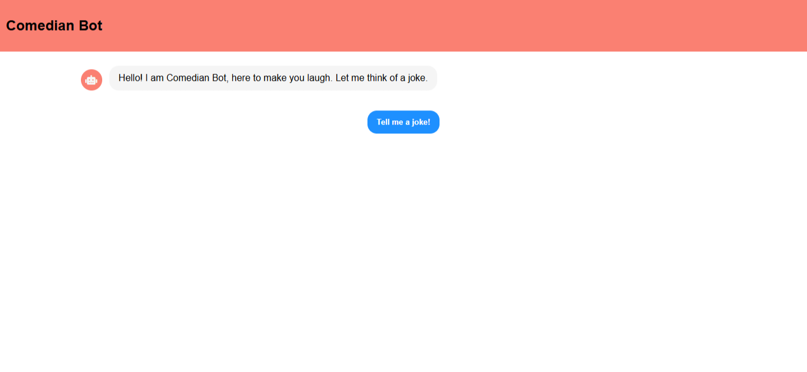

# Comedian Bot

Demo online: [https://giovannijorge.github.io/html-mimo/projetos/comedian-bot/](https://giovannijorge.github.io/html-mimo/projetos/comedian-bot/)

Descrição
--------
Comedian Bot é um pequeno projeto em HTML, CSS e JavaScript que fornece piadas e trocadilhos usando uma API pública de piadas. A aplicação permite obter piadas aleatórias, filtrar por categoria, buscar por palavra-chave, salvar favoritas e compartilhar. Foi pensado como um exercício prático de consumo de APIs, manipulação do DOM, armazenamento local e boas práticas front-end.

Funcionalidades
--------------
- Obter piada aleatória com um clique.
- Filtrar por categoria (por exemplo: Programming, Misc, Pun, Dark, etc.).
- Buscar piadas por palavra-chave.
- Exibir piadas em lista com suporte a piadas de texto único e piadas em duas partes (setup + delivery).
- Salvar e gerenciar piadas favoritas usando localStorage.
- Compartilhar piadas via Web Share API ou copiar para a área de transferência.
- Reprodução por voz (Text-to-Speech) usando a Web Speech API.
- Tratamento de erros e estados (carregando, sem resultados).
- Layout responsivo para mobile e desktop.

Como usar
--------
1. Abra o arquivo `index.html` localmente no navegador ou acesse a demo online:
   - [https://giovannijorge.github.io/html-mimo/projetos/comedian-bot/](https://giovannijorge.github.io/html-mimo/projetos/comedian-bot/)
2. Use o botão "Piada aleatória" para obter uma piada instantaneamente.
3. Selecione uma categoria no seletor para filtrar o tipo de piadas.
4. Use o campo de busca para procurar por uma palavra ou termo específico.
5. Clique no ícone de coração para salvar uma piada como favorita e acesse a seção "Favoritas" para gerenciá-las.
6. Use o botão de reprodução para ouvir a piada (seu navegador deve suportar a Web Speech API).
7. Compartilhe usando o botão de compartilhar ou copie o texto para a área de transferência.

Como funciona
-------------
A aplicação faz requisições à API pública de piadas (por exemplo, JokeAPI — https://v2.jokeapi.dev/) usando fetch:
- Endpoint base: `https://v2.jokeapi.dev/joke/`
- Parâmetros usados: `category` (ex.: Programming,Misc), `contains` (busca por termo), `type` (single / twopart), `amount` (quantidade)
- Os resultados são processados e renderizados dinamicamente como cards de piada.
- Para cada piada é possível: favoritar (salvar em localStorage), ouvir (SpeechSynthesis), compartilhar (Web Share API) ou copiar.
- Estados de carregamento e mensagens de erro são exibidos para melhorar a experiência do usuário.

Boas práticas aplicadas:
- Separação de responsabilidades entre HTML, CSS e JavaScript.
- Estados de carregamento e mensagens de erro claras.
- Uso do atributo `alt` em imagens e labels em campos de formulário para acessibilidade.
- Layout responsivo e elementos interativos acessíveis via teclado.

Exemplos
--------
- Obter uma piada de programação:
  - Ação: selecionar `Programming` e clicar em "Piada aleatória"
  - Resultado: uma piada relacionada ao universo da programação
- Buscar por palavra:
  - Entrada: `bug`
  - Resultado: lista com piadas que contém "bug" no texto
- Salvar favorita:
  - Clique no ícone de coração em uma piada para adicioná-la à lista de favoritas (persistente entre visitas)

Arquivos principais
-------------------
- `index.html` — interface do usuário.
- `style.css` — estilos e layout responsivo.
- `script.js` — lógica de consumo da API, filtros, busca, favoritos, TTS e manipulação do DOM.
- `preview.png` — imagem de preview usada neste README.

Tecnologias
-----------
- HTML5
- CSS3
- JavaScript (vanilla)
- Fetch API
- Web Storage (localStorage)
- Web Speech API (SpeechSynthesis)
- JokeAPI (https://v2.jokeapi.dev/) ou alternativa pública de piadas

Acessibilidade e boas práticas
------------------------------
- Labels em campos de formulário para compatibilidade com leitores de tela.
- Botões com foco visível e navegação por teclado.
- Indicação clara de estados (carregando / erro / sem resultados).
- Uso dos atributos ARIA onde apropriado para melhorar a experiência de leitores de tela.

Contribuição
------------
Contribuições são bem-vindas. Sugestões:
- Adicionar mais fontes de piadas ou fallback quando a API estiver indisponível.
- Melhorar filtragem e paginação de resultados.
- Implementar testes unitários ou E2E.
- Melhorar a usabilidade e acessibilidade (por exemplo, controles de velocidade/voz).

Para contribuir:
1. Fork este repositório.
2. Crie uma branch com sua feature: `git checkout -b minha-feature`.
3. Faça commits descritivos.
4. Abra um Pull Request descrevendo as mudanças.

Licença
-------
Nenhuma licença específica foi adicionada a este repositório por enquanto. Se desejar permitir reuso explícito, adicione um arquivo `LICENSE` (por exemplo MIT).

Autor
-----
Giovanni Jorge — repositório principal: [GiovanniJorge/html-mimo](https://github.com/GiovanniJorge/html-mimo)

Contato
-------
Problemas, dúvidas ou sugestões podem ser abertas como issues no repositório ou enviadas via perfil do GitHub.
