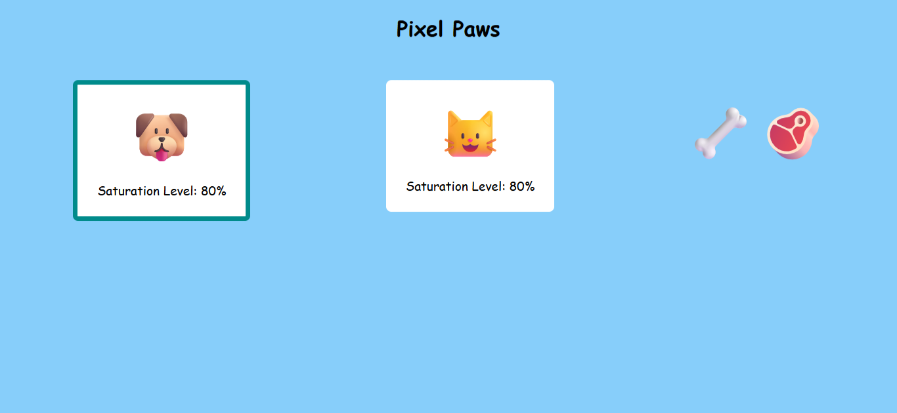

# Pixel Paws

Demo online: [https://giovannijorge.github.io/javascript-mimo/projetos/pixel-paws/](https://giovannijorge.github.io/javascript-mimo/projetos/pixel-paws/)

Descrição
--------
Pixel Paws é um pequeno projeto em HTML, CSS e JavaScript que simula um jogo de animais de estimação virtual interativo. A aplicação permite alimentar e cuidar de múltiplos animais de estimação (um cachorro e um gato), monitorando seu nível de saciedade. Foi pensado como um exercício prático de manipulação do DOM, programação orientada a objetos com classes JavaScript e gerenciamento de estado de componentes.

Funcionalidades
--------------
- Múltiplos animais de estimação com identificação individual.
- Seleção de qual animal alimentar através de clique.
- Dois tipos de alimento com diferentes valores nutricionais (osso: +1 ponto, carne: +5 pontos).
- Barra de saciedade que diminui automaticamente a cada 5 segundos.
- Indicador visual de seleção do animal atual (borda destacada).
- Mensagem de "Pet ran away" quando o nível de saciedade chega a 0%.
- Efeito visual (opacidade reduzida) para animais que fugiram.
- Layout responsivo com flexbox para múltiplos animais.
- Uso de emojis para representação dos animais (🐶 cachorro, 😺 gato) e alimentos (🦴 osso, 🥩 carne).

Como usar
--------
1. Abra o arquivo `index.html` localmente no navegador ou acesse a demo online:
   - [https://giovannijorge.github.io/javascript-mimo/projetos/pixel-paws/](https://giovannijorge.github.io/javascript-mimo/projetos/pixel-paws/)
2. Clique em um dos animais de estimação para selecioná-lo (o animal selecionado terá uma borda destacada em darkcyan).
3. Clique em um dos alimentos (osso 🦴 ou carne 🥩) para alimentar o animal selecionado.
4. Monitore o nível de saciedade do animal — ele diminui automaticamente a cada 5 segundos.
5. Se o nível de saciedade chegar a 0%, o animal fugirá e sua opacidade será reduzida.
6. Alimente seus animais regularmente para evitar que fujam!

Como funciona
-------------
A aplicação utiliza uma classe `Pet` para gerenciar cada animal de estimação:
- Cada animal possui seu próprio nível de saciedade (fedLevel), começando em 100%.
- Um intervalo (`setInterval`) executa a cada 5 segundos para diminuir o nível de saciedade de todos os animais.
- O DOM é atualizado dinamicamente para refletir o nível de saciedade atual.
- A seleção de qual animal alimentar é mantida em uma variável global `selectedPet`.
- Ao alimentar, o método `feed()` incrementa o nível de saciedade até o máximo de 100%.

Boas práticas aplicadas:
- Separação de responsabilidades entre HTML, CSS e JavaScript.
- Programação orientada a objetos com uso de classes ES6.
- Manipulação eficiente do DOM com seletores de ID.
- Uso de `classList` para adicionar/remover classes CSS dinamicamente.
- Layout responsivo com flexbox.
- Código limpo e bem estruturado com nomes descritivos.

Exemplos
--------
- Alimentar um animal:
  - Ação: clique em um animal, depois em um alimento
  - Resultado: o nível de saciedade do animal aumenta
- Monitorar saciedade:
  - Observação: a cada 5 segundos, o nível diminui em 10%
  - Resultado: se não alimentar, o animal foge após ~50 segundos
- Mudar de animal:
  - Ação: clique em outro animal
  - Resultado: a borda de seleção muda para o novo animal

Arquivos principais
-------------------
- `index.html` — interface do usuário com estrutura de animais e alimentos.
- `style.css` — estilos, layout com flexbox e design responsivo.
- `script.js` — lógica de classe Pet, seleção de animal, alimentação e intervalo de diminuição de saciedade.
- `preview.png` — imagem de preview usada neste README.

Tecnologias
-----------
- HTML5
- CSS3
- JavaScript (vanilla com classes ES6)
- DOM Manipulation

Acessibilidade e boas práticas
------------------------------
- Botões e elementos interativos com hover visível (cursor: pointer).
- Design intuitivo com feedback visual (borda de seleção, opacidade para animais fugidos).
- Cores de contraste adequado para melhor legibilidade (fundo azul claro com texto escuro).
- Uso de elementos semânticos HTML.
- Eventos onclick bem estruturados e vinculados a funções claras.

Possíveis melhorias
-------------------
- Adicionar persistência de dados com localStorage para salvar o estado dos animais.
- Implementar som ou animações quando um animal é alimentado.
- Adicionar mais tipos de animais ou alimentos.
- Criar um sistema de pontuação baseado em quanto tempo o animal sobrevive.
- Implementar diferentes estados emocionais do animal (feliz, triste, dorindo).
- Adicionar testes unitários para a classe Pet.

Contribuição
------------
Contribuições são bem-vindas. Sugestões:
- Adicionar novos tipos de animais ou alimentos.
- Melhorar animações e efeitos visuais.
- Implementar persistência de dados.
- Melhorar a acessibilidade (atributos ARIA, navegação por teclado).
- Adicionar testes unitários ou E2E.

Para contribuir:
1. Fork este repositório.
2. Crie uma branch com sua feature: `git checkout -b minha-feature`.
3. Faça commits descritivos.
4. Abra um Pull Request descrevendo as mudanças.

Licença
-------
Nenhuma licença específica foi adicionada a este repositório por enquanto. Se desejar permitir reuso explícito, adicione um arquivo `LICENSE` (por exemplo MIT).

Autor
-----
Giovanni Jorge — repositório principal: [GiovanniJorge/javascript-mimo](https://github.com/GiovanniJorge/javascript-mimo)

Contato
-------
Problemas, dúvidas ou sugestões podem ser abertas como issues no repositório ou enviadas via perfil do GitHub.
